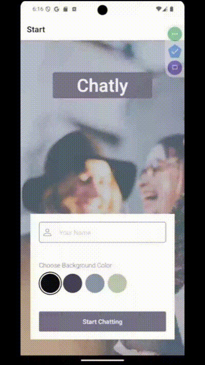
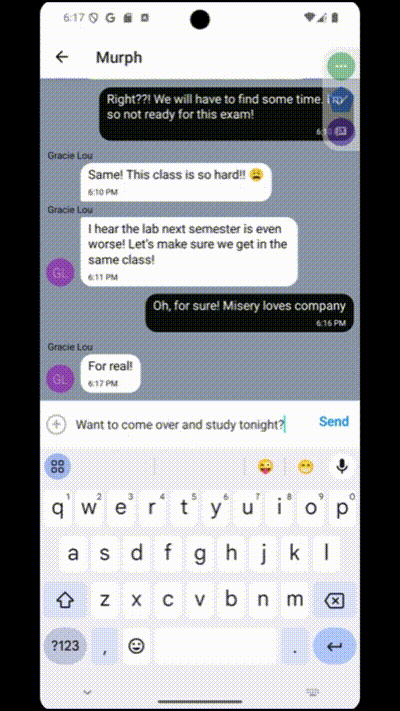
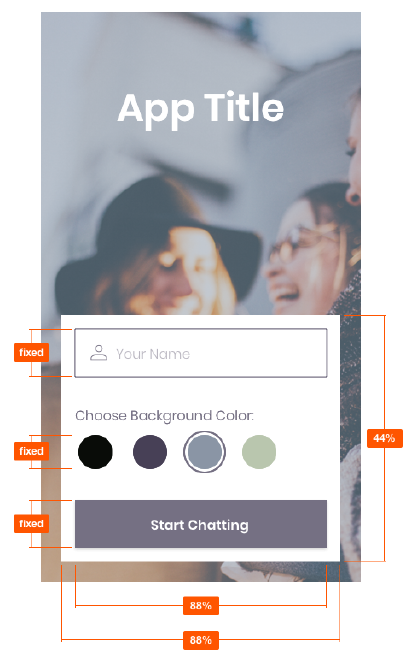

<!--  -->

# Welcome to Chatly!


The app where you can get chatty with your friends!

Chatly is a mobile chat application built with React Native. It provides users with a chat interface and options to share images and their location.

## Table of Contents

- [Welcome to Chatly!](#welcome-to-chatly)
  - [Table of Contents](#table-of-contents)
  - [Features](#features)
    - [User Stories](#user-stories)
      - [User Story 1: Chat Room Entry](#user-story-1-chat-room-entry)
      - [User Story 2: Send Messages](#user-story-2-send-messages)
      - [User Story 3: Send Images](#user-story-3-send-images)
      - [User Story 4: Share Location](#user-story-4-share-location)
      - [User Story 5: Offline Message Reading](#user-story-5-offline-message-reading)
      - [User Story 6: Screen Reader Compatibility](#user-story-6-screen-reader-compatibility)
    - [Key Features](#key-features)
      - [Feature 1: User Setup Page](#feature-1-user-setup-page)
      - [Feature 2: Chat Interface](#feature-2-chat-interface)
      - [Feature 3: Additional Communication Features](#feature-3-additional-communication-features)
      - [Feature 4: Data Storage](#feature-4-data-storage)
  - [Technical Requirements](#technical-requirements)
    - [Design Specifications](#design-specifications)
  - [Getting Started](#getting-started)
    - [Prerequisites](#prerequisites)
    - [Setting up the Development Environment](#setting-up-the-development-environment)
    - [Database Configuration](#database-configuration)
    - [Installation](#installation)
  - [Running the Application](#running-the-application)
  - [Troubleshooting](#troubleshooting)
  - [Dependencies](#dependencies)
  - [Dev Dependencies](#dev-dependencies)
  - [Project Structure](#project-structure)
  - [Contributing](#contributing)
  - [License](#license)

## Features

- User setup page for entering name and choosing chat background color
- Chat interface with conversation display, input field, and submit button
- Additional communication features: sending images and location data
- Online and offline data storage


### User Stories
#### User Story 1: Chat Room Entry
As a new user
  I want to be able to easily enter a chat room
  So that I can quickly start talking to my friends and family

```gherkin
Feature: Chat Room Entry  
  Scenario: New user enters a chat room
    Given I am a new user
    When I open the app
    Then I should see an option to enter a chat room
    And I should be able to enter the chat room with minimal steps
```
#### User Story 2: Send Messages
As a user
  I want to be able to send messages to my friends and family members
  So that I can exchange the latest news

```gherkin
Feature: Send Messages
  Scenario: User sends a text message
    Given I am in a chat room
    When I type a message
    And I press the send button
    Then my message should appear in the chat
    And other users in the chat should see my message
```


#### User Story 3: Send Images
As a user
  I want to send images to my friends
  So that I can show them what I'm currently doing
```gherkin
Feature: Send Images
  Scenario: User sends an image
    Given I am in a chat room
    When I select the option to send an image
    And I choose an image from my device
    And I confirm the image selection
    Then the image should be sent and appear in the chat
```
#### User Story 4: Share Location
As a user
  I want to share my location with my friends
  So that I can show them where I am

```gherkin
Feature: Share Location  
  Scenario: User shares their location
    Given I am in a chat room
    When I select the option to share my location
    And I confirm the location sharing
    Then my current location should be sent and displayed in the chat
```
#### User Story 5: Offline Message Reading
As a user
  I want to be able to read my messages offline
  So that I can reread conversations at any time

```gherkin
Feature: Offline Message Reading  
  Scenario: User reads messages offline
    Given I have previously received messages
    When I open the app without an internet connection
    Then I should be able to view my previous conversations
```
#### User Story 6: Screen Reader Compatibility
As a user with a visual impairment
  I want to use a chat app that is compatible with a screen reader
  So that I can engage with a chat interface
```gherkin
Feature: Screen Reader Compatibility 
  Scenario: Visually impaired user navigates the app
    Given I am a user with a visual impairment
    When I use the app with a screen reader
    Then all elements of the app should be properly labeled and navigable
    And I should be able to compose and send messages using the screen reader
```



### Key Features
#### Feature 1: User Setup Page
```gherkin
Feature: User Setup Page
  Scenario: User sets up their profile
    Given I am a new user
    When I open the app for the first time
    Then I should see a page where I can enter my name
    And I should be able to choose a background color for the chat screen
    And I should have an option to join the chat after completing these steps
```
#### Feature 2: Chat Interface
```gherkin
Feature: Chat Interface
  Scenario: User interacts with the chat interface
    Given I am in the chat room
    Then I should see a page displaying the conversation
    And I should see an input field for typing messages
    And I should see a submit button to send messages
```
#### Feature 3: Additional Communication Features
```gherkin
Feature: Additional Communication Features
  Scenario: User accesses additional communication options
    Given I am in the chat room
    Then I should have an option to send images
    And I should have an option to send location data
```
#### Feature 4: Data Storage
```gherkin
Feature: Data Storage
  Scenario: App stores data online and offline
    Given I am using the app
    When I send or receive messages, images, or location data
    Then this data should be stored online
    And this data should also be available offline
```

## Technical Requirements
- Built with React Native and Expo
- Uses Google Firestore Database for chat storage
- Firebase authentication for anonymous user authentication
- Local storage for offline message access
- Image picking and camera functionality
- Firebase Cloud Storage for image storage
- Location data sharing with map view
- Gifted Chat library for chat interface and functionality

### Design Specifications
- Vertical and horizontal spacing: evenly distributed
- App title: font size 45, font weight 600, font color #FFFFFF
- “Your name”: font size 16, font weight 300, font color #757083, 50% opacity
- “Choose background color”: font size 16, font weight 300, font color #757083, 100% opacity
- Color options HEX codes: #090C08; #474056; #8A95A5; #B9C6AE
- Start chatting button: font size 16, font weight 600, font color #FFFFFF, button color #757083



## Getting Started

### Prerequisites

- Node.js (version 16.19.0)
- npm (comes with Node.js)
- Expo CLI
- Expo Go app (for mobile testing)
- Android Studio (for Android emulator)
- Xcode (for iOS simulator, Mac only)

### Setting up the Development Environment

1. Install Node.js 16.19.0:
   ```
   nvm install 16.19.0
   nvm use 16.19.0
   ```

2. Install Expo CLI:
   ```
   npm install -g expo-cli
   ```

3. Set up Android Studio (for Android development):
   - Download and install Android Studio
   - Set up an Android Virtual Device (AVD) for emulation

4. Set up Xcode (for iOS development, Mac only):
   - Download and install Xcode from the App Store

### Database Configuration

1. Create a Firebase project:
   - Go to the Firebase Console (https://console.firebase.google.com/)
   - Create a new project
   - Set up Firestore Database
   - Set up Firebase Authentication (anonymous)
   - Set up Firebase Storage

2. Get your Firebase configuration:
   - In your Firebase project settings, find your web app's Firebase configuration
   - Copy the configuration object

3. Create a `firebaseConfig.js` file in the project root:
   ```javascript
   // firebaseConfig.js
   export const firebaseConfig = {
     apiKey: "YOUR_API_KEY",
     authDomain: "YOUR_AUTH_DOMAIN",
     projectId: "YOUR_PROJECT_ID",
     storageBucket: "YOUR_STORAGE_BUCKET",
     messagingSenderId: "YOUR_MESSAGING_SENDER_ID",
     appId: "YOUR_APP_ID"
   };
   ```

### Installation

1. Clone the repository:
   ```
   git clone https://github.com/your-username/chatly.git
   cd chatly
   ```

2. Install dependencies:
   ```
   npm install
   ```

## Running the Application

1. Start the development server:
   ```
   npm start
   ```

2. Use the Expo Go app on your mobile device to scan the QR code, or run on an emulator:
   - For Android Emulator: Press 'a' in the terminal
   - For iOS Simulator: Press 'i' in the terminal (Mac only)

## Troubleshooting

Common issues and their solutions:

1. **Issue**: Expo server connection failure
   **Solution**: Ensure your mobile device and development machine are on the same Wi-Fi network.

2. **Issue**: Android emulator not detecting Expo server
   **Solution**: Try running `adb reverse tcp:8081 tcp:8081` in your terminal.

3. **Issue**: Expo Go stops unexpectedly (Offline Error)
   **Solution**: The emulator may default to having Wi-Fi off when launched. Always turn on Wi-Fi immediately after launching the app. Without Wi-Fi, you won't be able to run your apps through Expo Go.

4. **Issue**: Expo Camera Error (Can't connect to camera)
   **Solution**: Close the emulator and perform a cold boot.

5. **Issue**: Android Emulator crashing or unstable
   **Solution**: If the app starts loading but crashes, try pressing 'a' in the Expo Metro Bundler console until the app fully launches.
   **Solution**: If the issue persists, close the emulator and perform a cold boot.


## Dependencies

```json
{
  "@expo/metro-runtime": "~3.2.3",
  "@expo/react-native-action-sheet": "^4.1.0",
  "@react-native-async-storage/async-storage": "^1.24.0",
  "@react-native-community/netinfo": "^11.4.1",
  "@react-navigation/native": "^6.1.18",
  "@react-navigation/native-stack": "^6.11.0",
  "expo": "~51.0.28",
  "expo-av": "^14.0.7",
  "expo-image-picker": "^15.0.7",
  "expo-location": "~17.0.1",
  "expo-media-library": "~16.0.5",
  "expo-status-bar": "~1.12.1",
  "firebase": "^10.3.1",
  "react": "18.2.0",
  "react-dom": "18.2.0",
  "react-native": "0.74.5",
  "react-native-get-random-values": "^1.11.0",
  "react-native-gifted-chat": "^2.6.3",
  "react-native-iphone-x-helper": "^1.3.1",
  "react-native-lightbox-v2": "^0.9.2",
  "react-native-maps": "1.14.0",
  "react-native-parsed-text": "^0.0.22",
  "react-native-reanimated": "~3.10.1",
  "react-native-safe-area-context": "^4.10.5",
  "react-native-screens": "3.31.1",
  "react-native-svg": "^15.2.0",
  "react-native-web": "~0.19.10",
  "uuid": "^10.0.0"
}
```

## Dev Dependencies

```json
{
  "@babel/core": "^7.20.0",
  "@babel/plugin-transform-react-jsx": "^7.25.2",
  "@babel/plugin-transform-unicode-property-regex": "^7.24.7",
  "@babel/preset-env": "^7.25.4",
  "@types/uuid": "^10.0.0"
}
```

## Project Structure

```
chatly/
│
├── assets/
│   └── [image files]
├── components/
│   ├── Chat.js
│   ├── CustomActions.js
│   └── Start.js
├── config/
│   └── firebaseConfig.js
├── contexts/
│   └── DatabaseContext.js
├── utils/
│   └── colorMatrix.js
├── App.js
├── package.json
└── README.md
```

## Contributing

1. Fork the repository
2. Create your feature branch (`git checkout -b feature/AmazingFeature`)
3. Commit your changes (`git commit -m 'Add some AmazingFeature'`)
4. Push to the branch (`git push origin feature/AmazingFeature`)
5. Open a Pull Request

## License

This project is licensed under the [MIT License](./LICENSE).